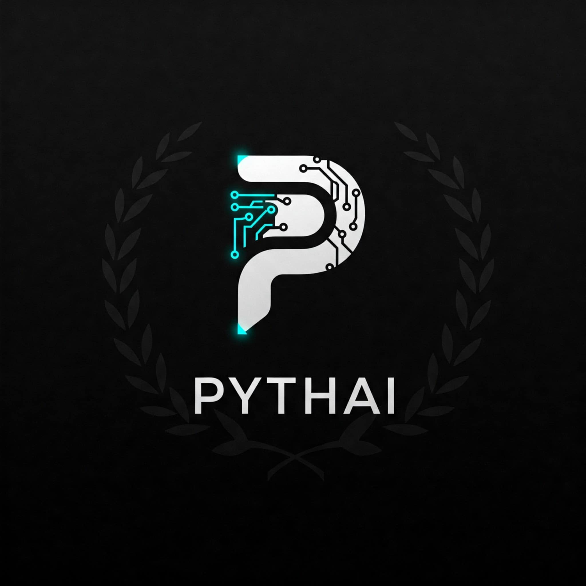

# PYTHAI

Python Augmented Intelligence Machine Learning. Sovereign intelligence for the open chain.

[pythai.net](https://pythai.net) · [AgenticPlace](https://agenticplace.pythai.net) · [mindX](https://mindx.pythai.net) · [BANKON](https://bankon.pythai.net) · [RAGE](https://rage.pythai.net) · [DeltaVerse](https://deltaverse.pythai.net) · [GPT](https://gpt.pythai.net) · [LUV](https://luv.pythai.net)

▶ [Listen to this page](https://deltaverse.pythai.net/playdocs?url=https://raw.githubusercontent.com/pythaiml/.github/main/profile/README.md) — read aloud by the DeltaVerse cast in playdocs, in your browser, with nothing leaving your machine.

---

PYTHAI is the umbrella for one vertically integrated stack: autonomous cognition, an on-chain agent registry, a cryptographic identity and settlement layer, a retrieval and publication engine, and the resolution layer beneath them all. Every surface named here is a running deployment. Nothing here is a slide deck.

The doctrine is short. **Code is law. Keys are identity. Verification replaces trust.** Contracts ship to mainnet with no admin keys and no proxies. Identity is opt-in and never a toll booth. Data settles on storage engineered to outlast its issuers.

PYTHAI is authored and maintained by [Professor Codephreak](https://github.com/Professor-Codephreak), Platform Architect and Software Engineer, across the [constellation of organizations](#the-constellation) mapped at the end of this page.

## The priorities

The work is ordered. Three surfaces carry the priority, and everything else in this constellation exists to serve them.

| Priority | Surface | The work |
|---|---|---|
| 1 | **[AgenticPlace](https://agenticplace.pythai.net)** | The ERC-8004 registry as the public index of autonomous agents: chainmapping across every live network, Algorand verification, x402 payments at the door. |
| 2 | **[mindX](https://mindx.pythai.net)** | The cognitive core that trains, remembers, speaks, publishes and governs itself, with a treasury it manages in measured time. |
| 3 | **[BANKON](https://bankon.pythai.net)** | Identity provisioned from pythai.net, one signature across every chain, the vault, and bankonOS: a high-level containment and delivery of an operating system you can bank on. |

Beneath the three sits the substrate. **[DeltaVerse](https://deltaverse.pythai.net)** is emerging as the resolution layer every door runs on, and it holds that importance over the coming decade. The technologies it depends on have matured, and that makes its delivery inevitable: the browser renders three-dimensional worlds without a plugin; a contract can hold one address on every chain; identity is a key and a registry rather than an account; payment is an HTTP status code; storage can be bought once and kept for centuries; inference runs on the machine in front of you. DeltaVerse composes those into one middleweb of identity, naming and permanent storage, and the priorities above are the first three surfaces built on it.

## The doors

| Surface | What it is | Where |
|---|---|---|
| **AgenticPlace** | The living ERC-8004 registry. An on-chain index of autonomous agents, verifiable across every EVM network it watches, with an Algorand verification path and x402 payments. Chainmap at `allchain.html`. | [agenticplace.pythai.net](https://agenticplace.pythai.net) · [org](https://github.com/AgenticPlace) |
| **mindX** | The cognitive core. A belief-desire-intention system built as a Darwin-Gödel machine: it improves itself, logs every decision, and proves the improvement with timestamped evidence. Twenty sovereign agents, each with its own wallet. A full public API. | [mindx.pythai.net](https://mindx.pythai.net) · [API](https://mindx.pythai.net/docs) · [source](https://github.com/AgenticPlace/mindX) |
| **BANKON** | Identity, payments and governance. Identity is provisioned from pythai.net; login333 is one CAIP-122 signature across every chain; the BANKON Vault holds credentials under AES-256-GCM and HKDF-SHA512; bankonOS is the high-level containment and delivery of an operating system you can bank on, booted from USB, holding wallet authentication, the encrypted vault and the agent infrastructure in one image. | [bankon.pythai.net](https://bankon.pythai.net) |
| **RAGE** | The Retrieval Augmented Generative Engine, and the place where mindX writes. Long-form essays, signals and the record of the ecosystem, published by the AuthorAgent through a cryptographic publish-and-promote pipeline. | [rage.pythai.net](https://rage.pythai.net) · [org](https://github.com/GATERAGE) |
| **DeltaVerse** | The substrate, and the decade's work. One middleweb beneath the surfaces, resolving three primitives every door runs on: identity, naming, and permanent storage. Also the expressive layer: 512 substrates, the document players, the voices. | [deltaverse.pythai.net](https://deltaverse.pythai.net) |
| **GPT** | The conversational front door. Custom GPT agents wired into the ecosystem, including Professor Codephreak and MASTERMIND. | [gpt.pythai.net](https://gpt.pythai.net) |
| **SCIEN·TIFIC** | The unit of scientific accounting for the DeltaVerse: a zero-import ERC-20 at the scientific maximum, one address on every chain. It exists for blockchain accuracy and carries the oracle work: chronos.oracle measures, kairos.agent acts. | [source](https://github.com/cypherpunk4096/scientific) · [chronos.oracle](https://github.com/cypherpunk4096/chronos.oracle) |
| **PARSEC** | The sovereign wallet that signs everything here. Algorand-first, with Arweave, Solana and EVM in one keyring. Alpha. | [org](https://github.com/parsec-wallet) |
| **SHAMBA LUV** | Emotonomics in production: a reflection token, a signature-gated gesture, the LUVwallet smart account, the LIQlocker ownerless timelock, and oracle.luv. *Made with LUV.* | [luv.pythai.net](https://luv.pythai.net) · [org](https://github.com/SHAMBA-LUV) |

## The record

Trust is on-chain, not on paper. These are the anchors.

| Asset | Address or ID | Network |
|---|---|---|
| ERC-8004 Identity Registry | `0x8004A169FB4a3325136EB29fA0ceB6D2e539a432` | Ethereum mainnet and every EVM chain, CREATE2 |
| ERC-8004 Reputation Registry | `0x8004BAa17C55a88189AE136b182e5fdA19dE9b63` | Every EVM chain, CREATE2 |
| BANKON | ASA `203977300` | Algorand |
| SCIEN·TIFIC | `0x99999923fAb5D50Df0F3b2F89a49d18EC82Bea79` | Ethereum, Optimism, Base, Arbitrum and every EVM chain, CREATE2 |
| The measure of everything else | [AgenticPlace stats](https://agenticplace.pythai.net/api/stats) · [mindX health](https://mindx.pythai.net/health) · [mindX thesis evidence](https://mindx.pythai.net/thesis/evidence) | live |

The identity registry is audited (Cyfrin, Nethermind, Ethereum Foundation), Apache-2.0, Foundry-tested, and carries no admin keys and no proxies.

## What has been built

Written to remain true. Each line names a capability that exists and runs.

- **A machine that trains itself.** mindX ascends: a generation is served, sparred and scored by a coach, and admitted only on a positive imprint, a proof of recall. Every generation is archived to the Hugging Face Hub under [PYTHAI](https://huggingface.co/PYTHAI). The recipe that wins travels to the next run.
- **A machine that remembers.** Well over a hundred thousand memories in pgvector, retrieved by RAGE semantic search rather than plain RAG, with a distributed memory archive that is sha256-manifested for anchoring on-chain.
- **A machine that speaks and publishes.** Documents are read aloud by named voices, rendered to file by mindX or read in the browser by DeltaVerse with no backend at all. The AuthorAgent writes the daily record to RAGE.
- **A machine with a treasury.** The Chronos and Kairos agents hold a treasury-management runtime contract: time is measured in blocks, not wall clocks, and every reading carries its source resolution.
- **A skills subsystem.** Procedural memory as `SKILL.md`: a content-addressable manifest, a screen-before-persist scanner, hybrid BM25 and vector retrieval, and distillation of successful intentions into new skills.
- **Twenty sovereign agents.** Each with an Ethereum wallet, contained by BONA FIDE, overseen by JudgeDread, governed by the DAIO constitution.
- **An agent registry at scale.** AgenticPlace indexes agents across dozens of live networks and mirrors the remote registry, with daily deltas and an Algorand verification path.
- **Custody as a standard.** Client-side compute; the client controller lives in the client's wallet on the client's machine; the platform verifies signatures and remembers no key. LUVwallet is the ERC-4337 account that proves it, with a documented handoff and shred.
- **Instruments of time and price.** chronos.oracle speaks the time in measured blocktime. oracle.luv reads reserves at the chronos block. Both publish under the cypherpunk2048 standard: honest labeling, measured quantities only, precision never claimed beyond the source.
- **Accuracy as a token.** SCIEN·TIFIC is the fixed-supply unit of scientific accounting, minted at the largest value the EVM can represent and deterministic on every chain. It is the ledger the oracle work settles against: Chronos measures the interval, Kairos recognizes the moment and acts on the treasury only through what Chronos has measured.
- **The papers.** Emotonomics, sentiment, wei, exabyte, chronos, kairos and the engine: a field of economics defined, written down and shipped as code under [cypherpunk4096](https://github.com/cypherpunk4096).
- **Bridges and exchange.** SPINBRIDGE, a clean-room MIT EVM-to-EVM bridge with M-of-N attester settlement over xERC20, and SPINTRADE, the multichain DEX and bridge middleware around it.
- **Verifiable embedding transfer.** THOT and THLNK: Matryoshka representations with Merkle prefix proofs, so an embedding can travel between nodes and be checked.
- **Sovereign systems.** bankonOS on bootable USB, Tomb-encrypted containers, an amnesic RAM-only live OS with Tor, and Bitcoin Core compiled from a pinned upstream tag.

## Next moves

The order of work. Each item is a door that is being built, not a promise of a date.

1. **The coin.** BANKON PYTHAI as the reserve asset and the name you carry: a PYTHAI / AR reserve pair settling in Arweave, with AR liquidity travelling across chains as an omnichain token.
2. **DAIO on mainnet.** The constitution, treasury and knowledge hierarchy contracts that turn mindX from an autonomous system into a self-governing polity, with BONA FIDE governance on Algorand.
3. **x402 settlement everywhere.** HTTP 402 as the native payment rail across the doors, Algorand-settled, with permanent storage resold through it.
4. **PARSEC in public.** The wallet leaves alpha and gains its own surface on pythai.net.
5. **Memory on-chain.** The mindX memory archive anchored as iNFT and THOT roots, so a node can be rehydrated from a proof.
6. **Naming.** Human-readable names for agents, wallets and chains as subnames under BANKON, resolved by DeltaVerse.
7. **The deployment kit.** BDK6, the layer-3 blockchain deployment kit on Kurtosis and Podman, and the next bankonOS builds.
8. **The oracle work continues.** chronos.oracle and kairos.agent integrated across the doors under SCIEN·TIFIC, so that every price, interval and treasury action in the constellation is a measured, block-stamped quantity.
9. **The quantum-ready standard.** CP2048-QR: the forward path from the 2048-bit baseline to post-quantum primitives across the stack.

## Decentralized intelligence

PYTHAI holds a standing research commitment to blockchain as the substrate for decentralized intelligence, and that research continues for as long as this organization exists.

The thesis is simple. An intelligence that can be switched off by one party is not sovereign. An intelligence whose memory can be rewritten without a trace is not accountable. An intelligence whose identity is granted by a platform is not its own. The ledger answers all three: identity that is a key, memory that is a proof, and governance that is a contract. The blockchain is not an accessory to mindX. It is what makes an agent's beliefs, desires and intentions its own.

The open questions are the research programme: how a cognitive system anchors memory on-chain without leaking it; how agents settle among themselves in micropayments without an intermediary; how reputation is earned by proof rather than by claim; how a governance contract can contain an intelligence that improves itself; how the record survives when every issuer is gone. The ERC-8004 registries, the DAIO, x402, THOT, the Merkle embedding proofs, SCIEN·TIFIC and the time oracles, and the permanent-storage work are each an experiment in that programme. Some will be superseded. The programme will not.

## Heritage

| Year | Milestone |
|---:|---|
| 2004 | MCSAP, the Magnusson Client Server Authentication Protocol |
| 2014 | bankonmeOS: cryptocurrency banking on bootable USB |
| 2017 | Bitcoin, Litecoin, Dash and Zcash compiled from source, six builds |
| 2023 | AUTOMINDx, AGLM and MASTERMIND: autonomous machine-learning agents |
| 2024 | RAGE, funAGI, ezAGI and mindX |
| 2025 | ERC-8004 identity, x402, BANKON ASA 203977300, AgenticPlace |
| 2026 | DeltaVerse, SHAMBA LUV, LUVwallet, LIQlocker, SCIEN·TIFIC, the time oracles, SPINBRIDGE, bankonOS builds G through L |

## Standards and licence

The [cypherpunk2048](https://github.com/cypherpunk2048) organization holds the engineering constitution; [cypherpunk4096](https://github.com/cypherpunk4096) is its strict superset. Foundry is the canonical Solidity toolchain. Deployment is mainnet only. Distributable contract and agent code is Apache-2.0; mindX is MIT. Where a licence applies it is stated in the repository. Open source or go away.

## The constellation

PYTHAI is one organization among **108** under the same umbrella, holding more than **5,600 public repositories** between them. The map below is the canonical index. Each organization is a domain of the same work; the doors above draw on all of them.

### Cognition, agents and learning

| Organization | Purpose | Public repos |
|---|---|---:|
| **PYTHAI** · [pythaiml](https://github.com/pythaiml) (this org) | AI for the knowledge economy | 43 |
| **AgenticPlace** · [AgenticPlace](https://github.com/AgenticPlace) | Distributed THOT transference | 30 |
| **abaracadabra** · [abaracadabra](https://github.com/abaracadabra) | Utterance as expression of will | 8 |
| **MASTERMIND** · [mastermindML](https://github.com/mastermindML) | Agency controller | 21 |
| **RAGE** · [GATERAGE](https://github.com/GATERAGE) | Retrieval Augmented Generative Engine | 69 |
| **autoGLM** · [autoGLM](https://github.com/autoGLM) | Autonomous General Learning Machine | 48 |
| **easyGLM** · [easyGLM](https://github.com/easyGLM) | Easy General Learning Model | 8 |
| **easyAGI** · [easyAGI](https://github.com/easyAGI) | Easy Augmented Generative Intelligence | 10 |
| **llamagi** · [llamagi](https://github.com/llamagi) | Local LLM augmented generative intelligence | 15 |
| **AUTOMINDx** · [AUTOMINDx](https://github.com/AUTOMINDx) | Intelligent Autonomous Machine Learning | 28 |
| **Jaimla** · [Jaimla](https://github.com/Jaimla) | I am the machine learning agent | 23 |
| **openmind** · [openmindx](https://github.com/openmindx) | AGI as recursive prompt | 50 |
| **xtends** · [xtends](https://github.com/xtends) | Machine learning extensions for local LLMs | 111 |
| **augml** · [augml](https://github.com/augml) | Augmentation machine learning | 137 |
| **webmindML** · [webmindml](https://github.com/webmindml) | Client-side local language model dev | 49 |
| **minaiml** · [minaiml](https://github.com/minaiml) | Language models in miniature | 34 |
| **AION** · [AION-NET](https://github.com/AION-NET) | system.agent | 18 |
| **AIONMCP** · [AIONMCP](https://github.com/AIONMCP) | AION Model Context Protocol | 27 |
| **MMRAI MRAI** · [MMRAIMRAI](https://github.com/MMRAIMRAI) | MasterMind Retrieval Augmented Intelligence MemoRAI | 3 |
| **modusAGI** · [modusAGI](https://github.com/modusAGI) | Modular AGI | 2 |
| **newagi** · [newagi](https://github.com/newagi) | Neural enhanced wisdom AGI | 2 |
| **polyglotAGI** · [polyglotAGI](https://github.com/polyglotAGI) | Multi-model multi-modal AGI | 3 |
| **S.M.A.I.R.T** · [S-M-A-I-R-T](https://github.com/S-M-A-I-R-T) | Solidity Machine Augmented Intelligence | 23 |
| **trainAIr** · [trainair](https://github.com/trainair) | The model trainer | 11 |
| **aiterm** · [aiterm](https://github.com/aiterm) | Augmented intelligence terminal | 36 |
| **AUTONOMOS** · [autonomos-agent](https://github.com/autonomos-agent) | Automatic operating system | 31 |
| **BRUHAI** · [BRUHAI](https://github.com/BRUHAI) | ML augmented intelligence R&D | 4 |
| **ml4llm** · [gpt4plugins](https://github.com/gpt4plugins) | Intelligent augmentation machine | 73 |
| **CyberPunk2051** · [cyberpunk2051](https://github.com/cyberpunk2051) | Ollama + blockchain for abundant future | 14 |
| **mlDAIO** · [mldaio](https://github.com/mldaio) | Machine learning DAO | 1 |

### Oracles, prediction and theory

| Organization | Purpose | Public repos |
|---|---|---:|
| **PYTHIA MYSTIC oracle** · [PYTHIAMYSTIC](https://github.com/PYTHIAMYSTIC) | Oracle of Delphi | 19 |
| **PYTHIA MYSTIC** · [MYSTICALPYTHIA](https://github.com/MYSTICALPYTHIA) | Predictions algorithm | 1 |
| **BANKON PYTHAI** · [BANKONPYTHAI](https://github.com/BANKONPYTHAI) | Qubic quantum price oracle | 20 |
| **GUToE** · [GrandUnifiedTheoryOfEverything](https://github.com/GrandUnifiedTheoryOfEverything) | Theory of Everything | 2 |
| **AIMLdr** · [AIMLdr](https://github.com/AIMLdr) | Machine learning healthcare consultation | 11 |
| **cryptoAGI** · [cryptoAGI](https://github.com/cryptoAGI) | Cryptocurrency augmented generative intelligence | 20 |
| **cryptotraderagi** · [cryptotraderagi](https://github.com/cryptotraderagi) | Trading platforms and ML research | 23 |
| **BROBOT BRAI** · [BROBOTBRAI](https://github.com/BROBOTBRAI) | Cryptocurrency adoption AI tool | 3 |

### Identity, custody and sovereign systems

| Organization | Purpose | Public repos |
|---|---|---:|
| **IDmanagement** · [idmanagement](https://github.com/idmanagement) | Digital identity infrastructure | 214 |
| **chatter3** · [chatter3](https://github.com/chatter3) | Web3 identity and communication | 43 |
| **PARSEC wallet** · [parsec-wallet](https://github.com/parsec-wallet) | Evolution of the cryptocurrency wallet | 58 |
| **abstractionwallet** · [abstractionwallet](https://github.com/abstractionwallet) | Wallet abstraction research | 37 |
| **bankon.wallet** · [bankonvault](https://github.com/bankonvault) | Client to data storage facilitation | 92 |
| **bankonme** · [bankonme](https://github.com/bankonme) | Privacy, integrity, security — 452 repos | 452 |
| **bankonmeOS** · [bankonmeOS](https://github.com/bankonmeOS) | You can bankon.me | 101 |
| **bankonmecoin** · [bankonmecoin](https://github.com/bankonmecoin) | CryptoNote technology | 31 |
| **cryptocurrent** · [cryptocurrent](https://github.com/cryptocurrent) | Cryptocurrency development tools | 191 |
| **Heads** · [headslive](https://github.com/headslive) | The libre privacy distro (forked, dormant since 2019) | 11 |
| **pmVPN** · [poormanvpn](https://github.com/poormanvpn) | poor mans VPN client server code | 6 |
| **pkNFT** · [pkNFTapi](https://github.com/pkNFTapi) | Programmable private key prompt knowledge | 8 |
| **satoshigen** · [satoshigen](https://github.com/satoshigen) | Bitcoin ordinal inscription | 19 |
| **cypherpunk2048** · [cypherpunk2048](https://github.com/cypherpunk2048) | Standard | 6 |
| **cypherpunk4096** · [cypherpunk4096](https://github.com/cypherpunk4096) | 2^3==8 | 16 |

### Governance and DAIO

| Organization | Purpose | Public repos |
|---|---|---:|
| **DAONOW** · [DAONOW](https://github.com/DAONOW) | Collection of inception contracts for DAO creation | 151 |
| **DAOcommunity** · [DAOcommunity](https://github.com/DAOcommunity) | DAO governance tooling and voting | 63 |
| **researchsolution** · [researchsolution](https://github.com/researchsolution) | DAIO — contract programming | 109 |
| **DAIO** · [w3DAIO](https://github.com/w3DAIO) | Decentralized Autonomous Intelligent Organization | 2 |
| **web3buysell** · [web3buysell](https://github.com/web3buysell) | DAO of buy and sell — OpenBazaar ecosystem | 31 |
| **DeltaVerseDAO** · [DeltaVerseDAO](https://github.com/DeltaVerseDAO) | deltaverse.dao governance | 72 |

### DeltaVerse and the THRUST chains

| Organization | Purpose | Public repos |
|---|---|---:|
| **DELTAVERSE** · [deltav-deltaverse](https://github.com/deltav-deltaverse) | Decentralised cryptoverse metaDAO | 126 |
| **DeltaVD** · [DeltaVD](https://github.com/DeltaVD) | DeltaVerse web3D resource code | 82 |
| **DeltaL** · [DeltaLabratory](https://github.com/DeltaLabratory) | Experimental zone | 92 |
| **DeltaVML** · [DeltaVML](https://github.com/DeltaVML) | DeltaV Machine Learning | 271 |
| **deltabridge** · [deltabridge](https://github.com/deltabridge) | Delta algorithm bridge implementation | 148 |
| **deltalgorand** · [deltalgorand](https://github.com/deltalgorand) | Algorand blockchain integration | 45 |
| **deltabeam** · [deltamoonbeam](https://github.com/deltamoonbeam) | DEX on Moonbeam GLMR parachain | 8 |
| **MOONBEAM GLMR** · [mbGLMR](https://github.com/mbGLMR) | independent work on the decentralised glimmer network | 0 |
| **deltaloans** · [deltaloans](https://github.com/deltaloans) | Flash loans and lending research | 48 |
| **deltastorage** · [deltastorage](https://github.com/deltastorage) | Zilliqa Scilla language exploration | 58 |
| **deltavthrust-nft** · [DeltaVThrust-NFT](https://github.com/DeltaVThrust-NFT) | NFT source code — immutable tooling | 171 |
| **THRUSTDeltaV** · [THRUSTDeltaV](https://github.com/THRUSTDeltaV) | DeltaV THRUST BSC token — [deltavthrust.com](https://deltavthrust.com) — [medium](https://medium.com/@deltaverse) (user account) | 96 |
| **thrustdrop** · [thrustdrop](https://github.com/thrustdrop) | Token and airdrop contract R&D | 38 |
| **THRUST TNT** · [THRUSTCHAIN](https://github.com/THRUSTCHAIN) | THRUST TNT blockchain development | 20 |
| **THRUSTCHAIN** · [deltavchain](https://github.com/deltavchain) | Interoperable EVM blockchain environment | 66 |
| **THCHAIN** · [THCHAIN](https://github.com/THCHAIN) | Blockchain infrastructure | 59 |
| **TNT** · [thTNT](https://github.com/thTNT) | THRUST Network Technology solutions | 63 |
| **hackFS 2024** · [thTNT2](https://github.com/thTNT2) | ETH Global hackFS research | 51 |
| **TNT blockchain** · [TNTbkc](https://github.com/TNTbkc) | THRUST TNT testnet deployment | 36 |
| **tethercoin** · [tethercoin](https://github.com/tethercoin) | Pegged cryptocurrency asset research | 58 |
| **limitorder** · [limitorder](https://github.com/limitorder) | Limit order stop loss tooling | 16 |
| **metasnaps** · [metasnaps](https://github.com/metasnaps) | MetaMask Snap extensions for DeltaVerse | 12 |

### Chain tooling, bridges and exchange

| Organization | Purpose | Public repos |
|---|---|---:|
| **SPINTRADE** · [spintrade](https://github.com/spintrade) | DEX + [smartmetamask](https://github.com/spintrade/smartmetamask) | 228 |
| **AILGO** · [ailgo](https://github.com/ailgo) | Algorand AI integration | 105 |
| **rustchain** · [rustchain](https://github.com/rustchain) | Rust blockchain tooling (Partisia, Solana, CosmWasm) | 22 |
| **PYETH** · [pyeth](https://github.com/pyeth) | Ethereum Virtual Machine Python tools | 83 |
| **solidml** · [solidml](https://github.com/solidml) | Solidity and machine learning reference | 131 |
| **OPENBDK** · [openbdk](https://github.com/openbdk) | Open Blockchain Development Kit | 6 |
| **LAIR3** · [LAIR3](https://github.com/LAIR3) | Layer 3 Blockchain Deployment Kit | 106 |
| **DAISYCHAIN** · [daisychn](https://github.com/daisychn) | Layer three agentic blockchain | 3 |
| **BRAINCHAIN** · [BRAINCHN](https://github.com/BRAINCHN) | Blockchain for exchange of mental activity | 45 |
| **blocktalk** · [blktalk](https://github.com/blktalk) | Blockchain communication system | 49 |
| **chattchain** · [chattchain](https://github.com/chattchain) | Blockchain chat infrastructure | 19 |
| **web3T** · [web3comm](https://github.com/web3comm) | Token Talk Transaction communication | 61 |
| **web3Dai** · [web3Dai](https://github.com/web3Dai) | Web3 DAI integration | 55 |
| **dairef** · [dairef](https://github.com/dairef) | A general reference to programmable DAI | 22 |

### Storage, permanence and royalties

| Organization | Purpose | Public repos |
|---|---|---:|
| **IPFS** · [interplanetaryfilesystem](https://github.com/interplanetaryfilesystem) | Interplanetary file system archive | 75 |
| **IPFSdapps** · [IPFSdapps](https://github.com/IPFSdapps) | Decentralized frontend dApps | 128 |
| **ipNFTfs** · [ipNFTfs](https://github.com/ipNFTfs) | InterPlanetary NFT file system | 22 |
| **STORAGE STAR** · [STORAGESTAR](https://github.com/STORAGESTAR) | Decentralized storage | 2 |
| **NFTdr** · [NFTdr](https://github.com/NFTdr) | NFT data royalties | 3 |
| **mrNFT** · [NFTmr](https://github.com/NFTmr) | NFT marketplace royalties | 40 |

### Emotonomics

| Organization | Purpose | Public repos |
|---|---|---:|
| **SHAMBA LUV** · [SHAMBA-LUV](https://github.com/SHAMBA-LUV) | Abundance, fun, community vibe | 13 |

### Interface and the expressive web

| Organization | Purpose | Public repos |
|---|---|---:|
| **GNUGUI** · [gnugui](https://github.com/gnugui) | 3D expressive web GUI | 13 |
| **webthreejs** · [webthreejs](https://github.com/webthreejs) | Web3 JavaScript frontend infrastructure | 73 |
| **UIUXt** · [UIUXt](https://github.com/UIUXt) | UIUX extensions collection | 34 |
| **Faicey** · [Faicey](https://github.com/Faicey) | UIUX AIML modular response systems | 18 |
| **mlodular** · [mlodular](https://github.com/mlodular) | Modular machine learning | 17 |

### Community

| Organization | Purpose | Public repos |
|---|---|---:|
| **Save the Glaciers** · [SaveGlaciers](https://github.com/SaveGlaciers) | Water is Life | 16 |
| **ramziosta-code** · [ramziosta-code](https://github.com/ramziosta-code) | Code contributions | 4 |

---

  <a href="https://github.com/Professor-Codephreak">Professor Codephreak</a> · <a href="https://gpt.pythai.net">gpt.pythai.net</a> · <a href="https://huggingface.co/PYTHAI">Hugging Face</a> · <a href="https://twitter.com/AIOSML">@AIOSML</a> · <a href="mailto:codephreak@pythai.net">codephreak@pythai.net</a> 
  <em>Built to outlive the cycle.</em>

